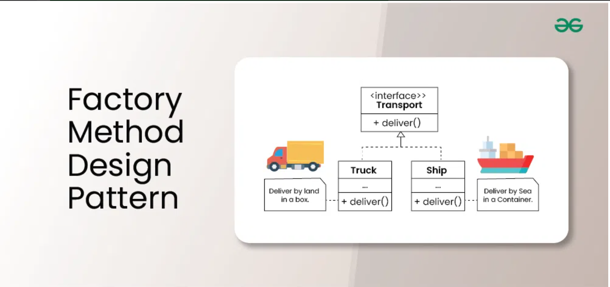
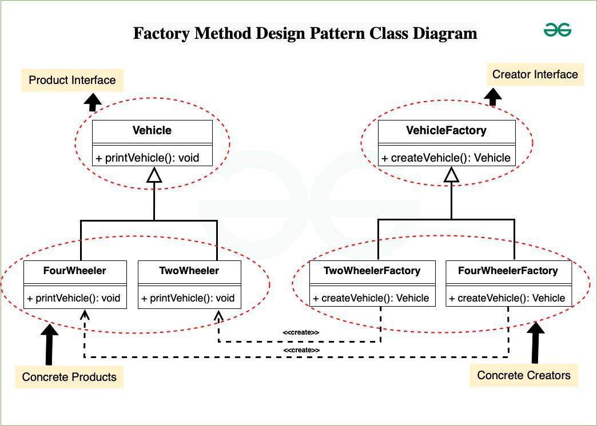

The Factory Method Design Pattern is a creational design pattern that provides an **interface for creating objects in a superclass, allowing subclasses to alter the type of objects that will be created**. This pattern is particularly useful when the **exact types of objects to be created may vary or need to be determined at runtime, enabling flexibility and extensibility in object creation.**
It provides an interface for creating objects in a superclass while allowing subclasses to specify the types of objects they create.

This pattern simplifies the object creation process by placing it in a dedicated method, promoting loose coupling between the object creator and the objects themselves.
This approach enhances flexibility, extensibility, and maintainability, enabling subclasses to implement their own factory methods for creating specific object types.

Below is when to use Factory Method Design Pattern:

1. A class can't anticipate the class of objects it must create.
2. A class wants its subclass to specify the objects it creates.
3. Classes delegate responsibility to one of several helper subclasses, and you want to localize the knowledge of which helper subclass is the delegate. 

**Components of Factory Method Design Pattern :**

1. **Creator:** 
This is an abstract class or an interface that declares the factory method. The creator typically contains a method that serves as a factory for creating objects. It may also contain other methods that work with the created objects.
2. **Concrete Creator:** 
Concrete Creator classes are subclasses of the Creator that implement the factory method to create specific types of objects. Each Concrete Creator is responsible for creating a particular product.
3. **Product:** 
This is the interface or abstract class for the objects that the factory method creates. The Product defines the common interface for all objects that the factory method can create.
4. **Concrete Product:** 
Concrete Product classes are the actual objects that the factory method creates. Each Concrete Product class implements the Product interface or extends the Product abstract class.

**When to use Singleton Method Design Pattern?**
1. To ensure that only one instance of a class exists in your application.
2. To provide a straightforward way for clients to access that instance from a specific location in your code.
3. For subclassing, so clients can work with the extended version without changing the original Singleton.
4. Used in situations like logging, managing connections to hardware or databases, caching data, or handling thread pools, where having just one instance makes sense

**Initialization Types of Singleton :**
1. **Early initialization :** In this method, class is initialized whether it is to be used or not. The main advantage of this method is its simplicity. You initiate the class at the time of class loading. Its drawback is that class is always initialized whether it is being used or not.
2. **Lazy initialization :** In this method, class in initialized only when it is required. It can save you from instantiating the class when you don’t need it. Generally, lazy initialization is used when we create a singleton class.

