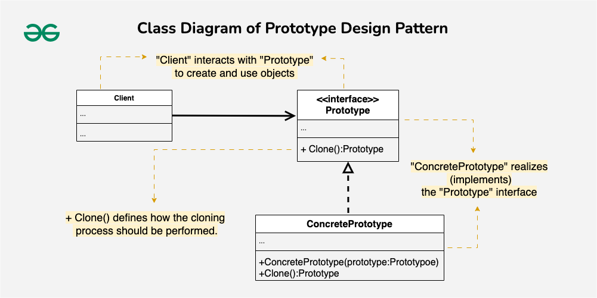

The prototype pattern is a creational design pattern **which is required when object creation is a time-consuming, and costly operation, so we create objects with the existing object itself to by copying the existing ones.**

The newly copied object may change the same properties only if required. This approach saves costly resources and time, especially when object creation is a heavy process.
One of the best available ways to create an object from existing objects is the **clone()** method. Clone is the simplest approach to implementing a prototype pattern. However, it is your call to decide how to copy existing objects based on your business model.

**Components of Prototype Design Pattern**

1. **Prototype Interface or Abstract Class :**

   This defines the method for cloning objects and sets a standard that all concrete prototypes must follow. Its main purpose is to serve as a blueprint for creating new objects by outlining the cloning contract.
   It includes a clone method that concrete prototypes will implement to create copies of themselves.
2. **Concrete Prototype :**

   This class implements the prototype interface or extends the abstract class. It represents a specific type of object that can be cloned.
   The Concrete Prototype details how the cloning process should work for instances of that class and provides the specific logic for the clone method.
3. **Client :**

   The Client is the code or module that requests new object creation by interacting with the prototype.
   It initiates the cloning process without needing to know the specifics of the concrete classes involved.
4. **Clone Method** :

   This method is declared in the prototype interface or abstract class and outlines how an object should be copied.
   Concrete prototypes implement this method to define their specific cloning behavior, detailing how to duplicate the object’s internal state to create a new, independent instance.

   
Below is when to use Protoype Design Pattern:
1. The Prototype pattern is helpful for managing various objects with minor differences. Instead of creating multiple classes, you can clone and modify prototypes.
2. Consider the Prototype pattern for dynamic configurations where you need to create objects at runtime. You can clone a base configuration and adjust it as necessary.
3. The Prototype pattern can lower initialization costs, as cloning is often faster than building a new object from scratch, especially if initialization is resource-intensive.