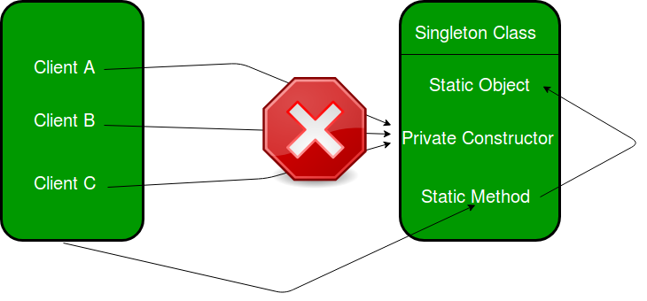
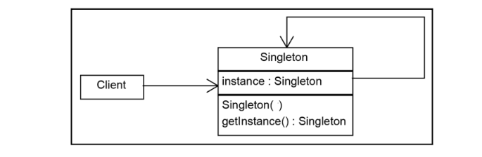

The Singleton Method Design Pattern **ensures a class has only one instance** and **provides a global access point to it**. It’s ideal for scenarios requiring centralized control, like **managing database connections or configuration settings**. 

**Singleton Design Pattern Principles**

**1.Single Instance:** Singleton ensures that only one instance of the class exists throughout the application.

**2.Global Access:** Provide a global point of access to that instance.

**3.Lazy or Eager Initialization:** Support creating the instance either when needed (lazy) or when the class is loaded (eager).

**4.Thread Safety:** Implement mechanisms to prevent multiple threads from creating separate instances simultaneously.

**5.Private Constructor:** Restrict direct instantiation by making the constructor private, forcing the use of the access point

**When to use Singleton Method Design Pattern?**
1. To ensure that only one instance of a class exists in your application.
2. To provide a straightforward way for clients to access that instance from a specific location in your code.
3. For subclassing, so clients can work with the extended version without changing the original Singleton.
4. Used in situations like logging, managing connections to hardware or databases, caching data, or handling thread pools, where having just one instance makes sense

**Initialization Types of Singleton :**
1. **Early initialization :** In this method, class is initialized whether it is to be used or not. The main advantage of this method is its simplicity. You initiate the class at the time of class loading. Its drawback is that class is always initialized whether it is being used or not.
2. **Lazy initialization :** In this method, class in initialized only when it is required. It can save you from instantiating the class when you don’t need it. Generally, lazy initialization is used when we create a singleton class.

