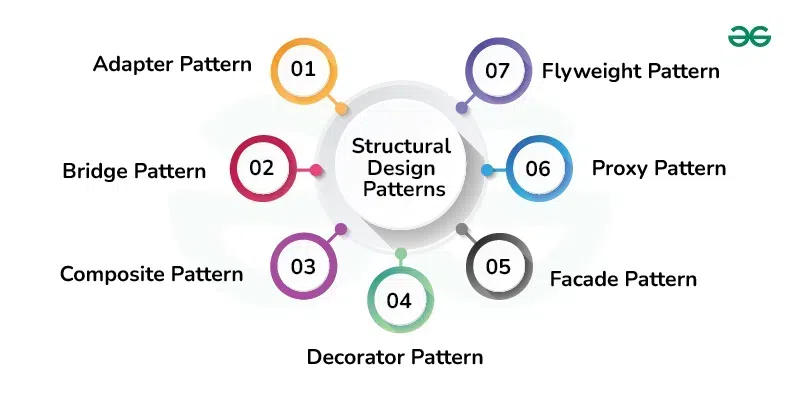

Structural design patterns focus on how classes and objects are arranged to create larger, more complex structures in software development. They help organize relationships between objects, making systems more flexible, reusable, and maintainable. By using these patterns, developers can create easier-to-understand and modify systems.

